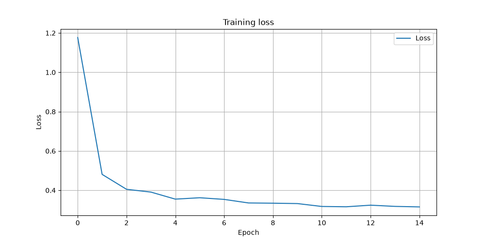
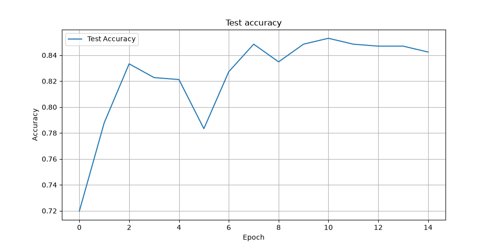

# Skin Cancer ResNet Transfer Learning

Binary classification of skin lesions (benign vs malignant) using transfer learning with a pretrained ResNet18 backbone. Only the final classifier head is trained, keeping the rest of the network frozen.

**Disclaimer:** This project is for educational and research purposes only. It is not intended for clinical or diagnostic use.

## Results

After 15 epochs on the [Melanoma Skin Cancer dataset](https://www.kaggle.com/datasets/hasnainjaved/melanoma-skin-cancer-dataset-of-10000-images):

| Metric | ResNet18 (final) | ResNet18 (best) | ResNet152 (final) |
|--------|------------------|-----------------|-------------------|
| Test accuracy | 84.24% | **85.30%** (epoch 11) | 84.39% |
| Train accuracy | 86.27% | — | 86.92% |
| Final loss | 0.3155 | — | 0.2970 |

ResNet152 was evaluated as a comparison and achieved nearly identical test accuracy with a much larger model. **ResNet18** was chosen as the final architecture for its similar performance, faster training, and smaller footprint.

### Training curves

| Loss | Test accuracy | Train accuracy |
|------|---------------|----------------|
|  |  |  |

A pretrained checkpoint is included at [`models/resnet18_skin_cancer.pth`](models/resnet18_skin_cancer.pth).

## Project structure

```
skin-cancer-resnet-transfer-learning/
├── src/skin_cancer_resnet/   # Model and training code
├── scripts/download_dataset.py
├── data/                     # Dataset (not committed)
├── models/                   # Trained weights
└── results/                  # Training plots
```

## Setup

Requires Python 3.10+ and a CUDA-capable GPU (optional; CPU works but is slower).

```bash
python -m venv .venv
source .venv/bin/activate
pip install -e .
```

### Download the dataset

1. Create a [Kaggle API token](https://www.kaggle.com/settings) and save it to `~/.kaggle/kaggle.json`.
2. Restrict permissions: `chmod 600 ~/.kaggle/kaggle.json`
3. Install the Kaggle CLI and download the data:

```bash
pip install kaggle
python scripts/download_dataset.py
```

This populates `data/train/` and `data/test/` with `benign/` and `malignant/` subfolders.

## Training

```bash
python -m skin_cancer_resnet.train \
  --data-dir data \
  --epochs 15 \
  --output-dir results \
  --model-path models/resnet18_skin_cancer.pth
```

Or use the installed CLI:

```bash
skin-cancer-train
```

Training applies random augmentations (flips, rotations, color jitter) and evaluates on both train and test sets each epoch. Plots are saved to `results/` and weights to `models/`.

## Inference

```python
import torch
from skin_cancer_resnet import Net

device = torch.device("cuda" if torch.cuda.is_available() else "cpu")
model = Net().to(device)
model.load_state_dict(torch.load("models/resnet18_skin_cancer.pth", weights_only=True))
model.eval()

# inputs: batch of preprocessed images (1, 3, 224, 224)
predictions = model.predict(inputs)
# 0 = benign, 1 = malignant
```

## Approach

- **Backbone:** ResNet18 with ImageNet weights (`torchvision.models.resnet18`)
- **Classifier:** Single linear layer (512 → 2), only trainable parameters
- **Optimizer:** Adam (lr=1e-3, weight_decay=1e-4)
- **Scheduler:** Cosine annealing over 15 epochs
- **Batch size:** 16
- **Input size:** 224×224, ImageNet normalization

## License

MIT — Copyright (c) 2026 Daniel Illescas Romero. See [LICENSE](LICENSE).
