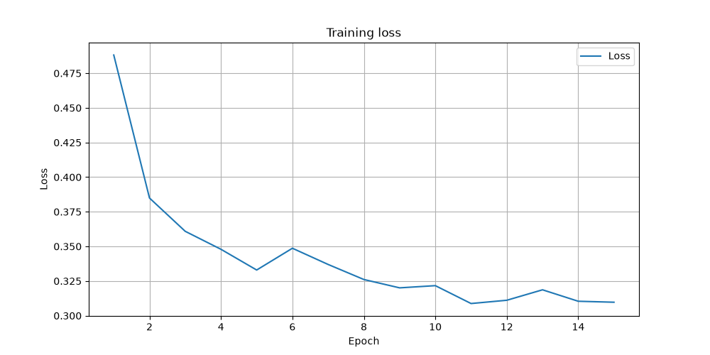
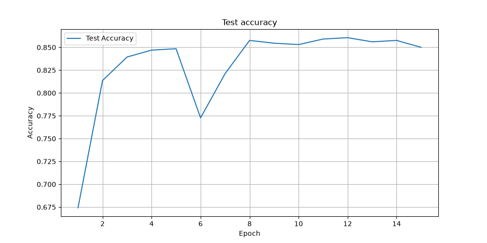
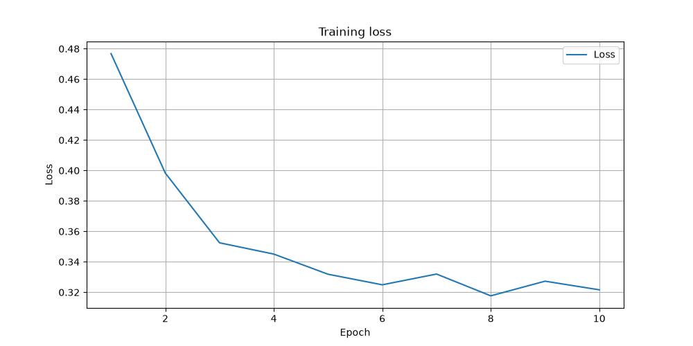
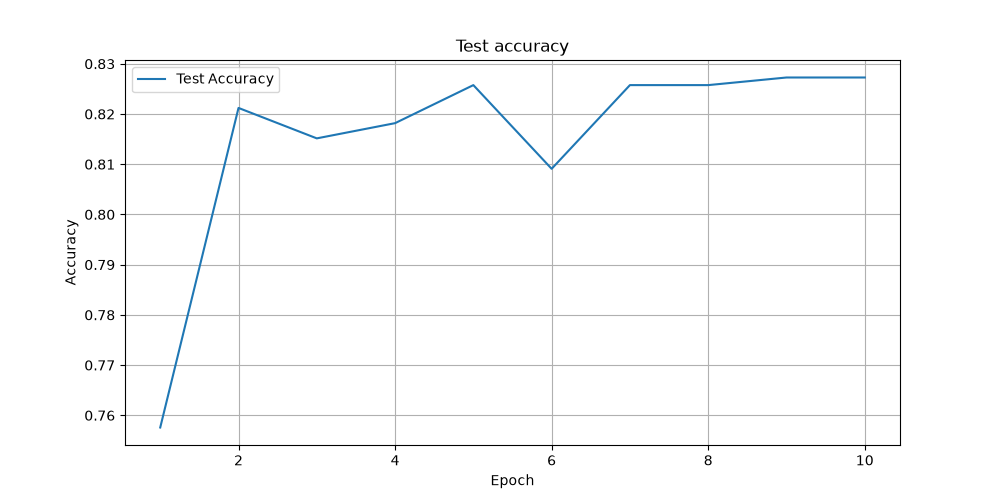
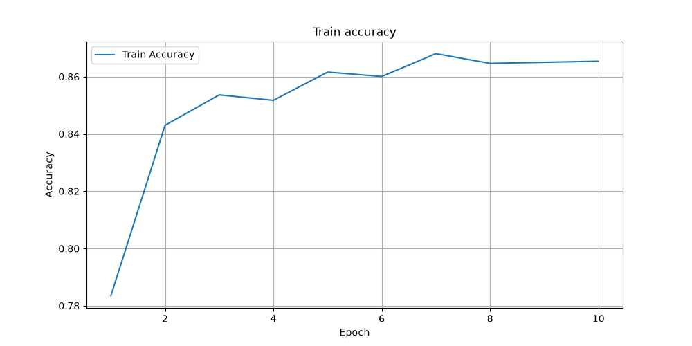

# Skin Cancer ResNet Transfer Learning

Binary classification of skin lesions (benign vs malignant) using transfer learning with a pretrained backbone. Only the final classifier head is trained, keeping the rest of the network frozen.

Supported architectures:

| Architecture | CLI value | Recommended epochs | Default checkpoint |
|--------------|-----------|-------------------|--------------------|
| ResNet18 (default) | `resnet18` | 15 | `models/resnet18_skin_cancer.safetensors` |
| MobileNetV3-Small (iOS / mobile) | `mobilenet_v3_small` | 10 | `models/mobilenet_v3_small_skin_cancer.safetensors` |

**Disclaimer:** This project is for educational and research purposes only. It is not intended for clinical or diagnostic use.

## Results

On the [Melanoma Skin Cancer dataset](https://www.kaggle.com/datasets/hasnainjaved/melanoma-skin-cancer-dataset-of-10000-images).

Saved checkpoints and the metrics reported below use the **best test-accuracy epoch** within each training run, not the final epoch. For example, with 15 epochs configured, if epoch 11 achieves the highest test accuracy, `models/resnet18_skin_cancer.safetensors` contains those weights — not the weights from epoch 15.

| Metric | ResNet18 | MobileNetV3-Small |
|--------|----------|-------------------|
| Test accuracy | **86.06%** (epoch 12) | **82.73%** (epoch 9) |
| Train accuracy (at best epoch) | 86.80% | 86.50% |
| Loss (at best epoch) | 0.3111 | 0.3273 |
| Epochs trained | 15 | 10 |
| Checkpoint size | ~45 MB | ~6 MB |

ResNet152 was evaluated historically and achieved 84.39% test accuracy with a much larger model. **ResNet18** remains the best accuracy overall. **MobileNetV3-Small** trades ~2.6 percentage points of test accuracy for an ~8× smaller checkpoint and faster inference, making it a better fit for on-device deployment (as used in [MalignantMolesDetector](https://github.com/illescasDaniel/MalignantMolesDetector)).

MobileNetV3 test accuracy plateaus around epoch 8–9 while train accuracy keeps climbing — a sign of **overfitting**. Training beyond ~10 epochs is unlikely to help and may hurt test performance, so 10 epochs is recommended (not 15).

### Training curves

**ResNet18**

| Loss | Test accuracy | Train accuracy |
|------|---------------|----------------|
|  |  |  |

**MobileNetV3-Small**

| Loss | Test accuracy | Train accuracy |
|------|---------------|----------------|
|  |  |  |

Pretrained checkpoints are included at [`models/resnet18_skin_cancer.safetensors`](models/resnet18_skin_cancer.safetensors) and [`models/mobilenet_v3_small_skin_cancer.safetensors`](models/mobilenet_v3_small_skin_cancer.safetensors).

## Project structure

```
skin-cancer-resnet-transfer-learning/
├── src/skin_cancer_resnet/   # Model, training, and inference code
├── scripts/
│   └── quality/              # checks.sh, ruff, pyright, etc.
├── data/                     # Dataset (not committed)
├── models/                   # Trained weights
└── results/                  # Per-architecture plots and metrics
    ├── resnet18/
    └── mobilenet_v3_small/
```

## Setup

Requires Python 3.10+. A GPU is optional; training and inference auto-select the best available device (CUDA, then Apple MPS, then CPU).

```bash
python -m venv .venv
source .venv/bin/activate
pip install -e ".[dev]"
```

### Download the dataset

Download the [Melanoma Skin Cancer dataset](https://www.kaggle.com/datasets/hasnainjaved/melanoma-skin-cancer-dataset-of-10000-images) from Kaggle (website or CLI) and extract it into `data/`. The layout is already correct: `data/train/` and `data/test/` each contain `benign/` and `malignant/` subfolders. No renaming or restructuring is required.

## Training

Training runs for a configurable number of epochs (`--epochs`). If omitted, the recommended value for the architecture is used (see table above). `--epochs` only controls how long training runs; the checkpoint written to `models/{architecture}_skin_cancer.safetensors` is always from whichever epoch achieved the highest test accuracy during that run.

**ResNet18** (15 epochs):

```bash
python -m skin_cancer_resnet.train \
  --data-dir data \
  --architecture resnet18
```

**MobileNetV3-Small** (10 epochs; as used in the [MalignantMolesDetector](https://github.com/illescasDaniel/MalignantMolesDetector) iOS app):

```bash
python -m skin_cancer_resnet.train \
  --architecture mobilenet_v3_small
```

Override epochs explicitly if needed:

```bash
python -m skin_cancer_resnet.train --architecture mobilenet_v3_small --epochs 10
```

Or use the installed CLI:

```bash
skin-cancer-train
```

### Training hyperparameters

Optimizer, scheduler, loss, learning rate, and related settings are grouped in `TrainingConfig` and exposed on the CLI:

| Flag | Default | Description |
|------|---------|-------------|
| `--lr` | `1e-3` | Initial learning rate |
| `--weight-decay` | `1e-4` | Adam weight decay |
| `--optimizer` | `adam` | Optimizer type |
| `--scheduler` | `cosine_annealing` | LR scheduler |
| `--criterion` | `cross_entropy` | Loss function |
| `--no-pretrained` | off | Skip ImageNet backbone weights |
| `--device` | auto | Override device (`cuda`, `cuda:0`, `mps`, `cpu`) |

Example with custom learning rate:

```bash
python -m skin_cancer_resnet.train --architecture resnet18 --lr 0.0001 --weight-decay 0.001
```

Full training settings are recorded in `results/{architecture}/metrics.json` under `training_config`.

### Parallel experiments

Run multiple training configurations in parallel from a JSON file:

```bash
skin-cancer-experiment --config experiments/example.json
```

Example config (`experiments/example.json`):

```json
{
  "data_dir": "data",
  "batch_size": 16,
  "seed": 28,
  "max_workers": 2,
  "experiments": [
    { "name": "resnet18-baseline", "architecture": "resnet18", "epochs": 15 },
    { "name": "resnet18-low-lr", "architecture": "resnet18", "initial_lr": 0.0001 }
  ]
}
```

Top-level keys are shared defaults; each experiment can override any training or run setting. When omitted, outputs go to `results/experiments/{name}/` and checkpoints to `models/experiments/{name}.safetensors`. On multi-GPU machines, experiments are assigned round-robin across CUDA devices; on a single GPU use `"max_workers": 1` (sequential) to avoid OOM.

> **Note:** `results/experiments/`, `models/experiments/`, and any `experiments/*.json` files other than `example.json` are git-ignored — sweep configs and their outputs are considered local artefacts.

Training applies random augmentations (flips, rotations, color jitter) and evaluates on both train and test sets each epoch. Plots and metrics are saved to `results/{architecture}/`; the best-epoch weights are saved to `models/`.

## Inference

Classify one or more images (files or directories):

```bash
skin-cancer-predict data/validation/IMG_4226.JPG
skin-cancer-predict path/to/image1.jpg path/to/images/
skin-cancer-predict --architecture mobilenet_v3_small path/to/image.jpg
```

Or run as a module:

```bash
python -m skin_cancer_resnet.predict data/validation/IMG_4226.JPG
```

Output is one line per image with the predicted label and confidence, e.g. `benign (62.1%)` or `malignant (87.3%)`.

Programmatic usage:

```python
from skin_cancer_resnet.architecture import Architecture
from skin_cancer_resnet.device import get_best_device
from skin_cancer_resnet.model import Net

device = get_best_device()
model = Net.from_checkpoint(
    "models/resnet18_skin_cancer.safetensors",
    device,
    architecture=Architecture.RESNET18,
)

# inputs: batch of preprocessed images (N, 3, 224, 224)
predictions = model.predict(inputs)
# 0 = benign, 1 = malignant
```

## Approach

- **Backbones:** ResNet18 or MobileNetV3-Small with ImageNet weights (`torchvision.models`)
- **Classifier:** Single linear layer (512 or 1024 → 2), only trainable parameters
- **Training config:** `TrainingConfig` controls optimizer (Adam), scheduler (cosine annealing), criterion (cross-entropy), learning rate, and weight decay
- **Device:** `get_best_device()` selects CUDA → MPS → CPU
- **Batch size:** 16
- **Input size:** 224×224, ImageNet normalization

## License

MIT — Copyright (c) 2026 Daniel Illescas Romero. See [LICENSE](LICENSE).

## Quality checks

```bash
pip install -e ".[dev]"
./scripts/quality/checks.sh          # check-only (matches CI)
./scripts/quality/checks.sh --fix    # Ruff autofix/format + shfmt on shell scripts
```

Steps: dependency audit → Ruff → ShellCheck + shfmt → codespell → pytest → basedpyright.

Individual scripts: `scripts/quality/{ruff,pyright,shellcheck,codespell,pytest}.sh`.
